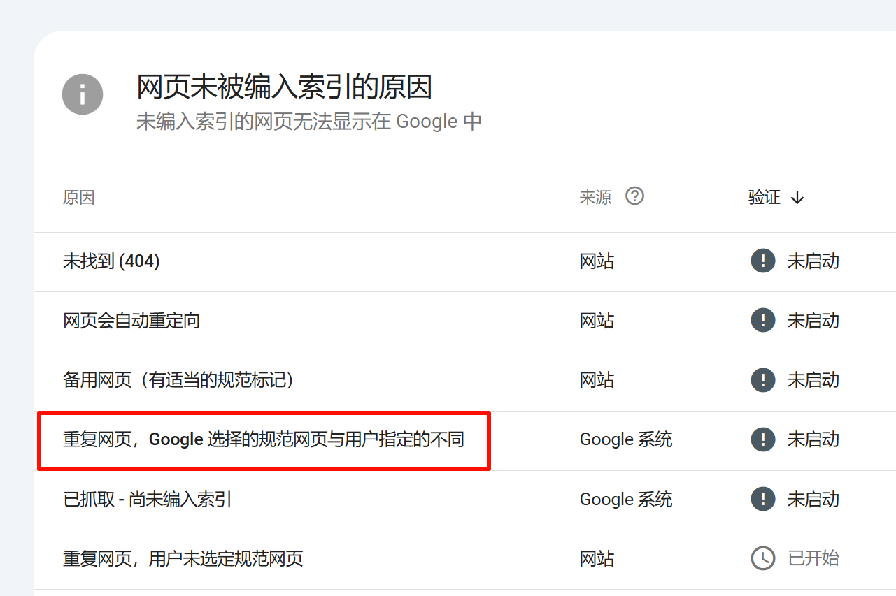
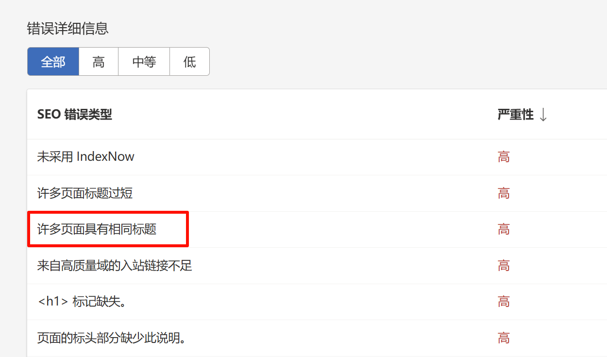

# 为 VitePress 添加 Canonical Meta 标签

Canonical Meta 标签（Canonical Tag）是 HTML 的一种标签，主要用于搜索引擎优化 (SEO)。其职责是在多个 URL 可以访问同一内容时，向搜索引擎指明首选的 URL，从而避免因为重复内容而导致的搜索引擎降权问题。

---

举个栗子，你的网站有两个 URL 都指向同一篇文章：

- `http://example.com/page`
- `http://example.com/page?utm_source=facebook`
  
如果搜索引擎发现这两条 URL 内容完全一致，它可能认为这是重复内容，进而影响排名。通过在页面的 HTML 头部添加 Canonical Tag，例如：

```html
<link rel="canonical" href="http://example.com/page">
```

你就告诉搜索引擎，这两个 URL 实际上指向的是相同的内容，首选的那个是`http://example.com/page`，从而避免负面影响。

这样，搜索引擎会将页面的权重集中在你指明的那个首选 URL 上，有助于提升 SEO 效果。Canonical Tag 对大部分现代搜索引擎如 Google、Bing 等都是有效的。

## 没有 Canonical Meta 标签的情况

Google Search Console 可能报错：

> 重复网页，Google 选择的规范网页与用户指定的不同此类
> 网页未编入索引或不会显示在 Google 搜索结果中



Bing Webmasters Tools 可能报错：

> 许多页面具有相同标题
下面页面有两个 URL，但其实是相同的页面，会被报为标题相同

- `http://www.example.com/page`
- `http://example.com/page`



## 为 VitePress 添加

```js
// .vitepress/config.js
export default defineConfig({
  // ...
  transformPageData(pageData) { // [!code ++]
    const canonicalUrl = `${host}/${pageData.relativePath}` // [!code ++]
      .replace(/index\.md$/, '') // [!code ++]
      .replace(/\.md$/, '.html') // [!code ++]
    pageData.frontmatter.head ??= [] // [!code ++]
    pageData.frontmatter.head.push([ // [!code ++]
      'link', // [!code ++]
      { rel: 'canonical', href: canonicalUrl } // [!code ++]
    ]) // [!code ++]
  }, // [!code ++]
})
